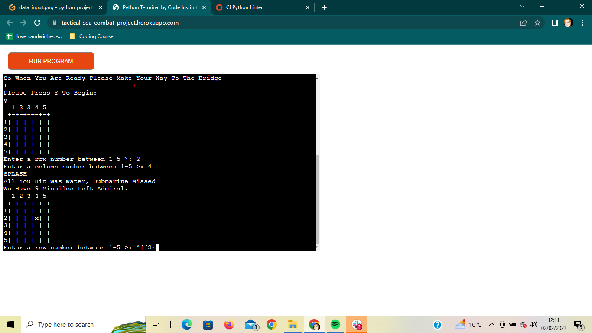
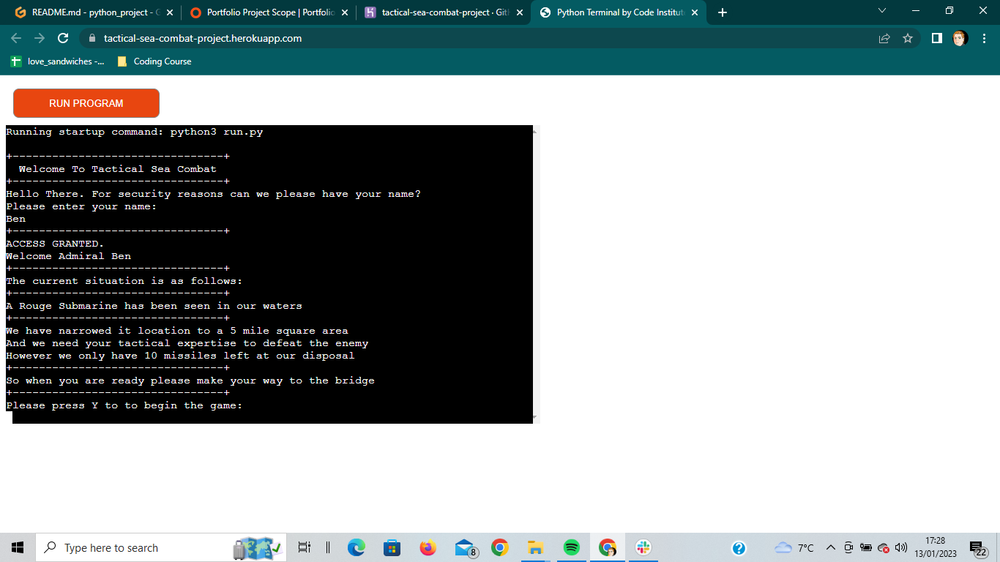
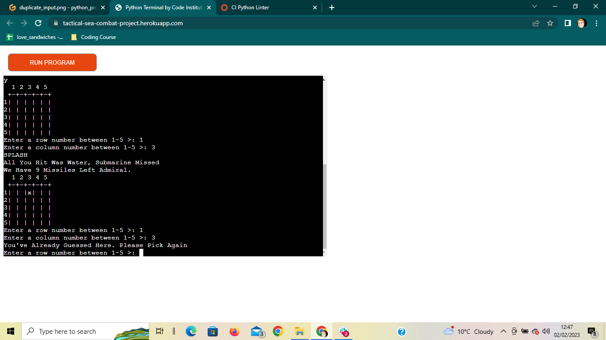
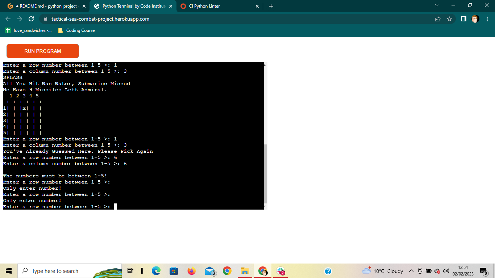
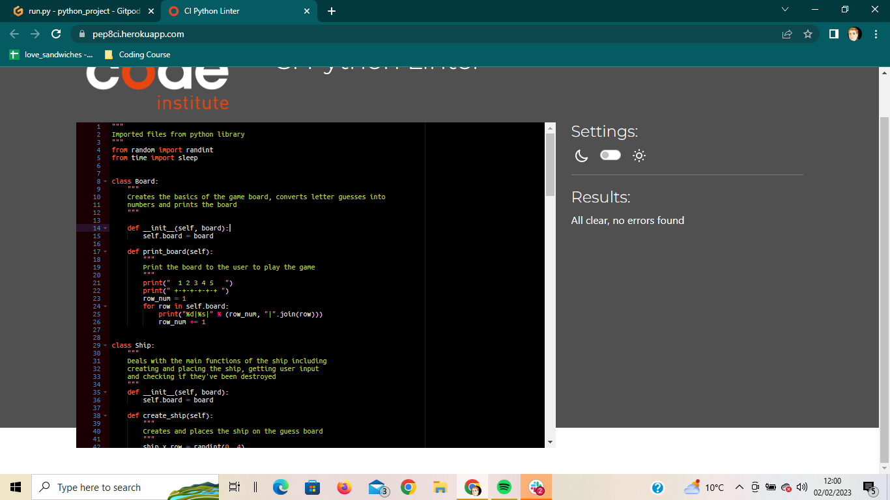

<h1>TACTICAL SEA COMBAT</h1>

Tactical Sea Combat is a python game, which runs in Heroku

Users are tasked with destroying an enemy submarine without running out of
missiles. The enemy sub will take up one square on the 5 by 5 game board.

<a href = "https://tactical-sea-combat-project.herokuapp.com/">Here is the live version of my project</a>

<h2>How To Play</h2>

Tactical Sea Combat is a version of the classic pen and paper and board game "Battleships".

In this version, the player is asked to enter their name to confirm their identity. They are then taken
to the "War Room" where they are given the basics rules of the game and are asked to confim they want to continue.

Upon confirming they want to play, two boards are created, a blank guess board and the computer's board which contains a single square containing a "#" symbol which is the location of the enemy submarine but isn't displayed to the user.

The player then has up to 10 guess to try and find the correct square containing the "#" and locate the enemy sub.

For every unsuccessful guess, a "x" will be added to both the guess and computer boards. This is so user knows where they have guessed and the computer can alert if a duplicate guess is made.

If the player is able to find the enemy sub within 10 turns they are deemed the winner but if they fail the enemy sub will escape and they will lose.

<h2>Features</h2>

<h3>Existing Features</h3>

* Random board generation
    * The enemy submarine is randomly place somewhere on the computer's board.
    * The subs location isn't visable to the player until they either successfully guess it's location or run out of missiles and lose, at which point it is displayed to the player
    

* Accepts user input
    * On several occasions the player is asked for input which effects the game in some way.
        * At the beginning of the game the player are asked for their name, which is then used to "athorise" their clearance and is used to refer to them by name in the introduction. This however can be left blank if the player does not wish to enter their name.
        
        * After the introductionary text explaining the game is the player is asked to press the "Y" key to proceed to the game. Until this is done the game won't proceed.
        
        * During the game the player is asked for their guesses using inputs of the number of the row and column they believe the sub is in.
        
        * After the game is won or lost the player is asked if they would like to restart the game using an input: "Y" restarts the game, "N" closes the game after a message is displayed and all other inputs result in the input request message to be replayed.
        
        
    
* The current guess board displayed with pass guess locations, which is updated as new guesses are made.

* Messages to the player after each guess saying if they were successful in hitting the enemy as well as a count of how many missiles (turns) they have left.

* Input validation and error-checking
    * The player must enter the correct input to start the game otherwise the message will continue to reprint until the player enters the required input.
    
    * During the game the player is unable to enter a number that doesn't respond to a row or column or the game board.
    
    * The player is unable to enter a dupliucate guess and is met with a message stating it's a duplicate guess and asks them to enter another guess.
    
    * The restart game message only allows you to enter "Y" to restart the game and "N" to end the game, any other input will result in the restart game message to be displayed again.
    

<h3>Future Features</h3>

* Have different difficulty levels with larger boards containing more submarines.
* Allow the player to compete against the computer, with each taking turns guessing where their opponent's submarines are positioned.
* Allow the player to position their own submarines.
* Have different size submarines.

<h2>Data Models</h2>

I decided to go with two classes as my model.

I went with a Board class to create both of the guess and computer boards. This works by using a print() method to print both boards to the desired dementions decided in the run_game() function. 

I also have a Ship class to create the sub, take the player's guess and deal with the sub being destroyed. This is done by using the create_ship() function to createand randomly position the sub, the get_input() function to recieve the player's guesses in the form of data input and use the destroyed_ship() function to see if the player's guess results in the enemy sub being destroyed.

<h2>Testing</h2>

I have manually tested this project in the following ways:
  * Passed it through the Code Institute Python Linter and recieved no errors
  
  * Given invalid data into all available inputs: 
    * Input strings when numbers were expected and numbers when strings were expected.
    
    * Input numbers that were out of the available range of co-ordinates
    
    * Input duplucate guesses
    
    * Input empty input fields
    
    * Input invalid options to the "Restart Game"
    
  * Tested in my local terminal and on the Heroku app

<h2>Bugs</h2>

<h3>Fixed Bugs</h3>

* The play_again() function would only run twice and wouldn't display the farewell message when you selected to end the game. I fixed this by adding a while True: to the start of the if/ else statement and a break after the farewell message.
* It was brought to my attention after publishing that inputting an empty input into the get_input() guess field would cause the game to crash. I fixed this by changing the design of the section from row being numbers and columns being letters to both being numbers. I did this as despite extensive research and trial and error, I could not find a solution to the problem  which didn't cause another issue or didn't fix the problem. After changing the columns to numbers I was able to put both inputs in a single try/ exept/ if statement, starting with a "while True" statement. This means the function could check for EOFErrors, check that the input is a valid selection and would still work as originally purposed.
* It was also brought to my attention after publishing that a similar issue occured with empty inputs would cause the play_again() field to crash. I fixed this issue by adding try and except statements before the if/ elif /else staements that I added to fix a previous bug. This let me account for possible EOFErrors and would prevent crashing.
* An empty input was accepted as an acceptable input in the start_game input option in the intro() function. I fixed this by moving the start_game input into it's own function called start_input(). There I put the input option into a try/ except/ if/ else statement starting with a "while True" statement. this allowed me to check for invalid and empty inputs correctly.

<h3>Known Bugs</h3>

* The create_ship() function was initionally meant to create several ships and the game board was meant to be larger however despite looking on several website and asking help from my peers the function would only ever print out one ship to the board, so I decided to change the general concept of the game from a long drawn out battle sim with many guesses to a quick, shot single target game which allows replayability.

<h2>Validator Testing</h2>

* PEP8
  * No errors were returned from https://pep8ci.herokuapp.com/
  
  

<h2>Deployment</h2>

This project was deployed using Heroku.

   * Steps for deployment:
     * Create a Heroku account.
     * Create a new Heroku app with a unique name.
     * Go to the "Settings" tab of the app and set any Config Vars that are required.
     * Also in the "Settings" set the Buildpacks to "Python" and "NodeJS" in that order.
     * Go to the "Deploy" tab and link Heroku to your GitHub account by selecting the "Github" option from the "Deployment Methods" section and entering your details.
     * Search for the repository you wish to use and click "Connect" to link the Heroku app to the repositories code.
     * Select either "Automatic Deploys" (where Heroku automatical redeploys the app when the code is changed) or "Manual Deploys" (Where you have to redeploy yourself when an changes are made) as your deployment method.
     * Once the app has successfully deployed select the "view" button to see the newly deployed app.

<h2>Credits</h2>

* Code Institute for the Python Essentials Temlate this project was made with.
* Heroku for use of there site to deploy the finished app.